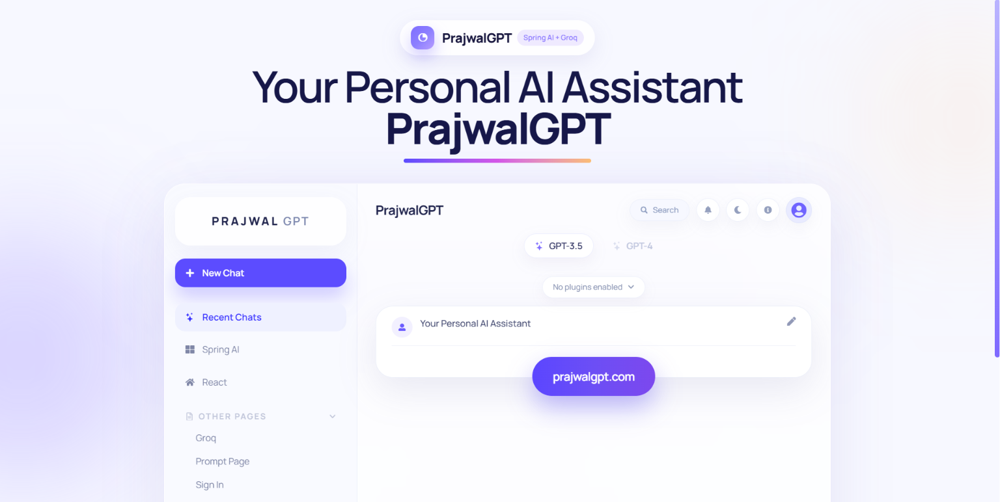
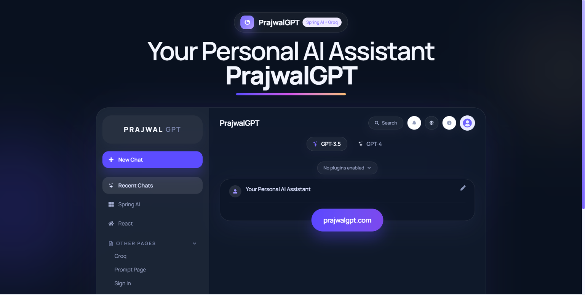
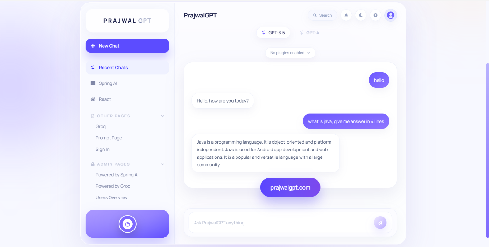

<div align="center">

# 🚀🤖 PrajwalGPT

### ✨ Your Personal AI Assistant Powered by **Spring AI + React + Groq**


---

# 🌐 Live Demo

### 🚀 https://prajwal-gpt-blush.vercel.app/

### ⭐ Don't forget to Star this Repository!

</div>

---

# ✨ About PrajwalGPT

PrajwalGPT is a **modern AI-powered chatbot** inspired by ChatGPT, built using **React, Spring Boot, Spring AI, and Groq LLM**.

It delivers **fast AI conversations**, **beautiful UI**, **dark/light themes**, **chat memory**, and a **production-ready full-stack architecture**.

This project demonstrates my skills in:

- 💻 Full Stack Development
- 🤖 AI Integration
- ⚛ Modern React Development
- 🍃 Spring Boot REST APIs
- 🎨 UI/UX Design
- ☁ Deployment
- 🚀 Clean Architecture

---

# 🎯 Project Highlights

✅ AI Powered Chatbot

✅ Beautiful Responsive UI

✅ Dark & Light Mode

✅ Spring AI Integration

✅ Groq LLM

✅ Chat Memory

✅ Markdown Rendering

✅ Modern Dashboard

✅ Production Ready

✅ Live Deployment

---

# 🖥 Application Preview

## ☀️ Light Mode

<p align="center">

</p>

---

## 🌙 Dark Mode

<p align="center">

</p>

---

## 💬 AI Chat Interface

<p align="center">

</p>

---

# ✨ Features

## 🤖 AI Features

- 💬 Intelligent Conversations
- 🧠 Context Aware Memory
- ⚡ Ultra Fast Responses
- 📝 Markdown Rendering
- 🚀 Groq AI Integration
- 🔥 Spring AI ChatClient

---

## 🎨 User Experience

- 🌙 Dark Theme
- ☀️ Light Theme
- 📱 Fully Responsive
- ✨ Glassmorphism UI
- 🎯 Smooth Animations
- ❤️ Modern Dashboard
- 💻 Desktop & Mobile Friendly

---

## ⚙ Backend

- 🚀 Spring Boot REST API
- ☕ Java 21
- 🤖 Spring AI
- ⚡ Groq Integration
- 🔒 Secure Configuration
- 📦 Maven Build

---

# 🛠 Tech Stack

## Frontend

- ⚛ React 19
- ⚡ Vite
- 🎨 Tailwind CSS
- 🌈 Framer Motion
- 📡 Axios
- 📜 React Markdown
- 🎯 React Icons

---

## Backend

- ☕ Java 21
- 🍃 Spring Boot
- 🤖 Spring AI
- 📦 Maven

---

## AI

- 🧠 Groq LLM
- 💬 Spring AI ChatClient
- 🔥 Conversation Memory

---

## Deployment

- ▲ Vercel
- 🚀 Spring Boot

---

# 🏗 Architecture

```
             👨 User
                │
                ▼
        ⚛ React Frontend
                │
           Axios API
                │
                ▼
     🍃 Spring Boot Backend
                │
                ▼
      🤖 Spring AI ChatClient
                │
                ▼
          🧠 Groq AI Model
                │
                ▼
         AI Generated Response
```

---

# 📂 Folder Structure

```
📦 PrajwalGPT

├── 📁 frontend
│   ├── components
│   ├── hooks
│   ├── pages
│   ├── assets
│   ├── services
│   └── App.jsx
│
├── 📁 backend
│   ├── controller
│   ├── config
│   ├── service
│   ├── resources
│   └── Application.java
│
├── 📁 screenshots
│   ├── home-light.png
│   ├── home-dark.png
│   └── chat.png
│
└── README.md
```

---

# ⚡ Getting Started

## Clone Repository

```bash
git clone https://github.com/yourusername/PrajwalGPT.git
```

## Frontend

```bash
cd frontend

npm install

npm run dev
```

## Backend

```bash
cd backend

mvn spring-boot:run
```

---

# 🔑 Environment Variables

### Backend

```properties
SPRING_AI_GROQ_API_KEY=YOUR_API_KEY
```

### Frontend

```env
VITE_API_URL=http://localhost:8080
```

---

# 💡 Skills Demonstrated

✔ Full Stack Development

✔ Java

✔ Spring Boot

✔ Spring AI

✔ React

✔ REST API Development

✔ Responsive UI

✔ AI Integration

✔ Deployment

✔ Clean Architecture

✔ State Management

✔ Modern Dashboard Design

---

# 🚀 Future Enhancements

- 🔐 User Authentication
- 💾 Database Chat History
- 📂 File Upload Support
- 🎤 Voice Assistant
- 🖼 AI Image Generation
- 🌍 Multi Language Support
- 📄 PDF Chat
- ⚡ Streaming Responses
- 📊 Analytics Dashboard

---

# 🏆 Why This Project Stands Out

🌟 Built using the latest technologies.

🤖 AI-powered conversational assistant.

🎨 Beautiful premium dashboard UI.

⚡ Optimized frontend performance.

💬 Context-aware AI conversations.

📱 Fully responsive across devices.

☁ Live production deployment.

💼 Demonstrates real-world software engineering skills.

---

# 👨‍💻 Developer

## **Prajwal**

### 💙 Full Stack Java Developer | React Developer | AI Enthusiast

🚀 Passionate about building scalable Full Stack and AI applications.

---

# 🌍 Connect With Me

💼 LinkedIn

🔗 https://linkedin.com/in/your-link

💻 GitHub

🔗 https://github.com/yourusername

📧 Email

yourmail@gmail.com

---

<div align="center">

# 🌟 If you like this project

## ⭐ Star this Repository

## 🍴 Fork it

## ❤️ Follow me on GitHub

---

# 🚀 Building Intelligent Applications with Java, Spring Boot & AI

**Thanks for Visiting ❤️**

</div>
